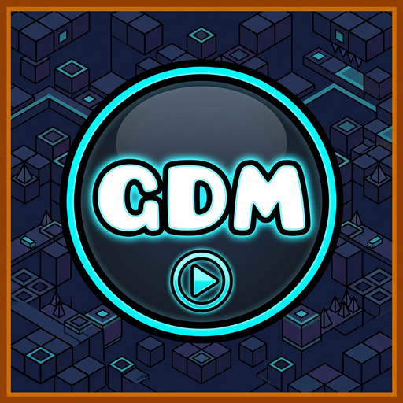

# GDMenu
Geode mod for GD 2.2081 (Geode v5): a bot (GDR2 / .gdbot), resume where you left off, frame stepper, noclip, speedhack, hitboxes and a start-pos switcher.

## How to use
Nothing is shown while you play. **Pause** and tap the floating **GDMenu** button. You can drag it anywhere, and it remembers where you put it.

| Tab | What's inside |
|---|---|
| **Bot** | Status, Record / Play / Save Bot, and **Resume session** (continue where you left off) |
| **Bots** | Every `.gdr2` / `.gdbot` file in `save/geode/mods/cyber39dreamgd.gdmenu/replays`, with Load / Delete / Open Folder |
| **Hacks** | Noclip, Show Hitboxes, Speedhack (with speed controls) |
| **Tools** | Frame Stepper, Start Pos Switcher |
| **Video** | Ready-to-copy **Title** & **Description** for your botted level's showcase; **Edit Template** opens the template files |
| **Keys** | PC keybinds, Settings, Reset Button Position |

## Bot files
- `.gdbot` uses **exactly the same binary layout as `.gdr2`** ([GDReplayFormat v2](https://github.com/maxnut/GDReplayFormat)), so it should also work in Eclipse Menu, xdBot and other GDR2 bots.
- Frames use `m_currentProgress` (240 ticks per second), and player-2 inputs are only saved in 2-player levels (GDR2 convention).
- If you quit while recording, the session is saved. Next time, open **Bot > Resume**: the bot fast-forwards to where you left off, freezes on that frame, and keeps recording.

## Mobile & PC
- **PC:** hidden keybinds for every hack (change them in Settings).
- **Mobile:** larger buttons. While the frame stepper is on, small **+1 / +10 / Play** buttons appear so you can step with touch. This is the only thing that ever shows during gameplay.

## Build
Pushes are built automatically by GitHub Actions (download **Build Output**). To build locally: `geode build`.
